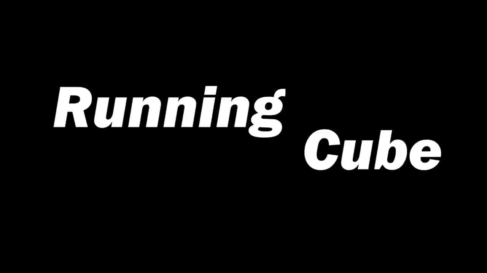

# Running Cube — Unity WebGL

**Running Cube** is a 3D action runner built in Unity (2021.3.3f1) and compiled to
WebGL for instant browser play — no install required. You steer a cube down a
neon road, dodge and destroy obstacles, collect power-ups that mutate the cube,
and either chase a high score in **Endless mode** or work through a multi-world
**level campaign**.

> ⚠️ The repository folder is historically named `flappyduck` and an old Unity
> build was titled the same. **The game is *Running Cube*.** All player-facing
> titles and the hostable build under [`docs/`](docs/) have been renamed
> accordingly.

- **▶ Play (original, Unity Play):** https://play.unity.com/en/games/d06e1929-3884-4da6-a40f-3649f2d27f46/running-cube
- **▶ Play (self-hosted static build):** see [Hosting as a static website](#hosting-as-a-static-website)

---

## Table of contents

- [Gameplay](#gameplay)
- [Controls](#controls)
- [Game modes](#game-modes)
- [Power-ups & pickups](#power-ups--pickups)
- [Obstacles & hazards](#obstacles--hazards)
- [Worlds & portals](#worlds--portals)
- [Technical design](#technical-design)
- [Analytics & telemetry](#analytics--telemetry)
- [What we learned: analytics insights → improvements](#what-we-learned-analytics-insights--improvements)
- [Demo & media](#demo--media)
- [Hosting as a static website](#hosting-as-a-static-website)
- [Project layout](#project-layout)
- [Built with](#built-with)

---

## Gameplay

You control a cube travelling along a road. Move **left/right** to weave between
hazards and **jump** (double-jump supported) over them. The cube carries a
**health bar of hearts** — most obstacles chip away a heart rather than killing
you instantly, and `cherry` pickups restore health. Touching certain obstacles
also makes the cube **dizzy**, forcing a quick recovery mini-game. Run out of
hearts, fall out of bounds, or hit a lethal hazard and the run ends on the
`gameover` scene.

Scattered along the road are **power-up cubes** that transform your cube — grow,
shrink, gain orbiting stars, clone yourself, shoot bullets, turn invisible, flip
gravity, and more.

---

## Controls

| Input | Action |
|---|---|
| **← / →** (Left / Right Arrow) | Steer the cube horizontally |
| **Space** | Jump (up to a double-jump while grounded) |
| **← / →** alternating | Recover from *dizziness* after a rock hit |
| On-screen buttons | Menu, Replay, Next Level, Leaderboard, name entry |

---

## Game modes

### Endless mode
Survive as long as possible while the world scrolls. Score climbs with distance/
time, power-up cards appear, and your final score can be submitted to an **online
leaderboard** (PlayFab) after entering a username. A health system and a wider
play boundary give players more room to recover from mistakes.

### Level campaign
A sequence of hand-built levels organized as `Level_1_x` → `Level_4_x` spanning
themed worlds. Each level is "passed" once you survive to its target time, and
clearing it with no damage taken records a **Perfect** clear. Levels feed into a
**star system** and unlock the next stage. Transitional "medium" levels were
added between easy and hard levels to smooth the difficulty curve, and each level
opens with a short explanation to reduce early frustration.

---

## Power-ups & pickups

Collected by running into tagged pickup cubes (see `Assets/Scripts/controller.cs`):

| Pickup | Effect |
|---|---|
| **bigger** | Scales the cube up ×1.2 and raises jump height |
| **smaller** | Scales the cube down ×0.8 |
| **faster** | Speeds up the orbiting stars |
| **longger** | Increases orbiting-star size/length |
| **shooter** | Cube fires bullets forward (can destroy obstacles); clones shoot too |
| **invisible** | Temporary invincibility — alpha drops and collisions are ignored |
| **clone** | Spawns a half-size clone that mirrors your stars, shots, and pickups |
| **star_upgrade** | Adds another star orbiting the cube |
| **cherry** | +1 heart (health) |
| **gravity** | Toggles reversed gravity |
| **gravity_size** | Toggles stronger gravity |
| **fps** | Toggles a first-person camera view |
| **move_forward** | Auto-advances the cube forward |

Long-term pickups (`bigger`, `smaller`, `faster`, …) are capped per run by an
"eat limit"; short-term buffs (`invisible`, `star_upgrade`) are always available.

---

## Obstacles & hazards

- **Rocks** — collision triggers a **dizziness** state; recover by alternately
  tapping ← and → until the on-screen "Recover %" reaches 100%.
- **Water** — a static hazard players learned to avoid; ties into the oxygen UI.
- **Moving obstacles** — blocks that travel up/down and sit at varied positions
  and shapes, so a single dodge pattern no longer works.
- **Shooting enemies / following enemies** — actively threaten the cube.
- **Boss** — the `demo2 boss2` scene enables a shooting boss encounter.
- **Out-of-bounds** — leaving the (now enlarged) play boundary ends the run.

Obstacles were deliberately **modularized and made less instantly fatal** so that
multiple solutions exist for getting past them, and so a run ends from accumulated
damage across varied hazards rather than a single mistake.

---

## Worlds & portals

Running into a **portal** randomly teleports the cube into a different themed
world and adjusts the world scroll speed:

- **earth** — lighter gravity variant
- **ice** — faster world speed (×1.3)
- **small** — shrunken-world variant
- **mud** — themed world scene

A camera rig follows the cube in third person (offset `(0, 6, −8)`, pitched 22°)
and smoothly lerps to a first-person position when FPS mode is toggled.

---

## Technical design

### Physics & movement
The cube is driven by Unity's 3D `Rigidbody`. Horizontal movement is direct
position stepping per `FixedUpdate`; jumping applies an instant vertical velocity
(`jump_height`), with a grounded double-jump granted on landing on a `Plane`.
Gravity is set globally (`Physics.gravity`) and varies per world / power-up
(reversed and larger-gravity modes).

```
Update():      if Space && jumps_left > 0  -> queue jump, jumps_left--
FixedUpdate(): if jump -> rb.velocity = (0, jump_height, 0)
               steer left/right by direct transform translation
               rotate orbiting stars around the cube
               if shooter active -> spawn bullets on an interval
```

### Shared game state
`GlobalData` is a `DontDestroyOnLoad` singleton holding cross-scene state — cube
health/hearts, scale, star count/size, world & speed, clone list, gravity flags,
shooting cadence, dizziness counters, etc. `ScoreManager` / `ScoreData` track
score, per-level pass + "perfect" flags, death causes, and power-up tallies.

### Health system
Hearts are instantiated into the Health UI; obstacles decrement health, `cherry`
restores it, and `Perfect` clears are detected by comparing health at level start
vs. end. This replaced the original instant-death design.

### WebGL build
Unity exports `index.html` + `Build/` + `TemplateData/` + `StreamingAssets/`. The
original Unity Play build uses **Brotli** compression for the data/framework/wasm.
Because plain static hosts (like GitHub Pages) don't send the `Content-Encoding:
br` header Unity's loader expects, the [`docs/`](docs/) copy ships the build
**decompressed** so it runs on any static server — see below.

---

## Analytics & telemetry

Two telemetry paths are wired in:

- **Google Forms logging** — `Assets/Scripts/SendToGoogle.cs` POSTs a row of
  gameplay metrics on each run: session ID, score, playtime, counts of each
  power-up eaten (bigger/smaller/faster/longer/invisible/shooter), death cause
  flags (`killedByWater`, `killedByCeil`, `killedByBound`), per-level
  `levelXY` / `levelXYPassed` flags, star upgrades, and whether the tutorial was
  played.
- **PlayFab** — `Assets/Scripts/playfabManager.cs` powers the Endless-mode
  leaderboard and username entry.

---

## What we learned: analytics insights → improvements

These are the surprising findings from our midterm playtest data and the
hypotheses/changes they drove (source:
`analytics/Surprising analytics from midterm and Hypotheses.pptx`).

**1. Difficulty was bimodal — too hard at first, then trivial**
Player counts clustered at both the lowest and highest score ranges. New players
had no idea how to play or use cubes, but once they practiced it became easy.
→ *Added a health system for more chances per run, enriched the tutorial, and
made obstacles more modular and less fatal so more solutions exist.*

**2. Levels had low pass ratios and no sense of progression**
Some levels had significantly low passing ratios, and levels lacked ordering and
connection — players lost motivation to keep trying.
→ *Added medium "transition" levels between easy and hard, added an explanation at
the start of each level, and introduced the health + star systems to allow
mistakes.*

**3. Endless mode had essentially one cause of death**
Players avoided static obstacles like water well; almost all deaths were from
being knocked **out of bounds**.
→ *Diversified obstacles (moving, repositioned, reshaped), enlarged the boundary,
and added the health system so death comes from varied impacts, not a single
mistake.*

**4. Survey feedback: confusing UI and lack of competition**
Players were confused by the cube icons/context, wanted competition, and cited
instant death/difficulty as the biggest issue.
→ *Improved textures so reactions are clearer, added a **leaderboard** to endless
mode and a **star system** to levels, and added the health system plus less-fatal
obstacles for more survivability.*

---

## Demo & media

### Gameplay walkthrough (in-repo)

[](docs/media/running-cube-demo.mp4)

▶ **[Watch the demo](docs/media/running-cube-demo.mp4)** — click the thumbnail
above (GitHub opens an inline player). It also streams from the GitHub Pages site
at `media/running-cube-demo.mp4`, and can be embedded directly:

```html
<video src="docs/media/running-cube-demo.mp4" controls width="720"></video>
```

> **About the file size.** The original demo is 1080p / ~5 min / **330 MB** —
> far over GitHub's 100 MB per-file hard limit. The committed copy is re-encoded
> to **720p H.264, ~44 MB** (two-pass, `+faststart` for web streaming), which is
> under GitHub's 50 MB soft warning and plays inline in the browser. The full set
> of source clips below stays out of git for the same reason.

### Other feature clips (not committed)

Additional clips were recorded but are **not committed** — each exceeds the
100 MB limit or, together, would blow past the repo/LFS budget. Distribute them
via an external host (YouTube/Drive) or [GitHub Releases](https://docs.github.com/en/repositories/releasing-projects-on-github)
assets (up to 2 GB each, off-repo), then link them here.

| File (source) | Shows |
|---|---|
| `demo/Running Cube_demo_2.mp4` | Full gameplay walkthrough → compressed copy above |
| `demo/Running Cube_demo.mp4` | Earlier full demo |
| `tutorial.mp4` | Tutorial / onboarding flow |
| `boss.mp4` | Boss encounter |
| `clone.mp4` | Clone power-up |
| `portal.mp4` | Portal world-switching |
| `shooting.mp4` | Shooter power-up / bullets |
| `spin fast.mp4` | Fast-spinning stars |
| `stars.mp4` | Star pickups & star system |
| `bigger2.mp4` | Grow/shrink power-up |
| `midterm/csci-526-mideterm.mp4` | Midterm milestone video |

> To compress any of these into the repo the same way, run:
>
> ```bash
> ffmpeg -y -i "INPUT.mp4" -c:v libx264 -b:v 1200k -pass 1 -preset medium -vf scale=-2:720 -an -f mp4 NUL
> ffmpeg -y -i "INPUT.mp4" -c:v libx264 -b:v 1200k -pass 2 -preset medium -vf scale=-2:720 -c:a aac -b:a 96k -movflags +faststart "docs/media/OUTPUT.mp4"
> ```

---

## Hosting as a static website

The [`docs/`](docs/) folder contains a ready-to-host, **decompressed** WebGL build
(`Build/RunningCube.{data,wasm,framework.js,loader.js}` + `TemplateData/` +
`StreamingAssets/` + a `.nojekyll` marker). Because the artifacts are uncompressed,
they work on any plain static host without special headers.

### Option A — GitHub Pages (zero config)
1. Push the repo.
2. In **Settings → Pages**, set the source to **`main` branch / `/docs` folder**.
3. The game is served at `https://<user>.github.io/<repo>/`.

### Option B — Run locally
WebGL requires HTTP (the browser blocks `file://`):

```bash
# from the docs/ folder
cd docs
python -m http.server 8000
# then open http://localhost:8000
```

```powershell
# PowerShell equivalent
cd docs
python -m http.server 8000
```

> The original Brotli-compressed build is preserved under `WebGL Builds/` and a
> gzip build under `bulid/`; these are kept as the raw Unity exports. Use `docs/`
> for static hosting.

---

## Project layout

```
.
├── Assets/                     # Unity project source
│   ├── Scripts/                # Gameplay C# (controller, GlobalData, ScoreManager,
│   │   │                       #   healthSystem, playfabManager, SendToGoogle, …)
│   │   ├── controller.cs       # Core cube controller (movement, pickups, levels)
│   │   ├── GlobalData.cs       # Cross-scene singleton game state
│   │   ├── SendToGoogle.cs     # Google Forms analytics POST
│   │   └── playfabManager.cs   # PlayFab leaderboard / username
│   ├── Scenes/                 # menu, tutorial, endless, Level_*, worlds, gameover…
│   └── prefab/                 # Cube, Health UI, Camera, Plane, …
├── docs/                       # ✅ Static-hostable build (Running Cube, decompressed)
├── WebGL Builds/               # Raw Unity WebGL export (Brotli .br)
├── bulid/                      # Older Unity WebGL export (gzip .gz)
├── analytics/                  # (course delivery) midterm analytics .pptx
├── demo/                       # (course delivery) demo videos
├── Packages/ · ProjectSettings/
└── README.md
```

---

## Built with

- **Unity 2021.3.3f1** — 3D, WebGL build target
- **C#** gameplay scripts
- **Rigidbody / 3D physics** — gravity, jump impulses, collisions, triggers
- **TextMesh Pro** — UI text
- **Post-processing** — neon look (`neon_profile`, `demo2_Profiles`)
- **PlayFab SDK** — online leaderboard & accounts
- **Google Forms** — gameplay telemetry capture
- **Unity WebGL** — browser deployment (Brotli source build; decompressed copy for static hosting)
